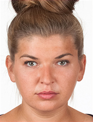
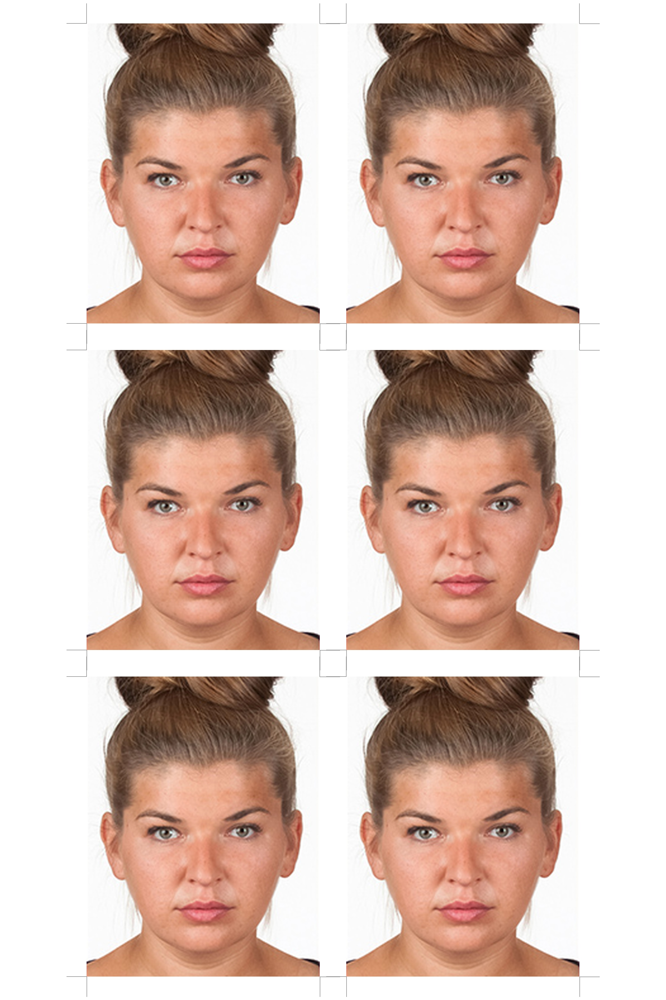
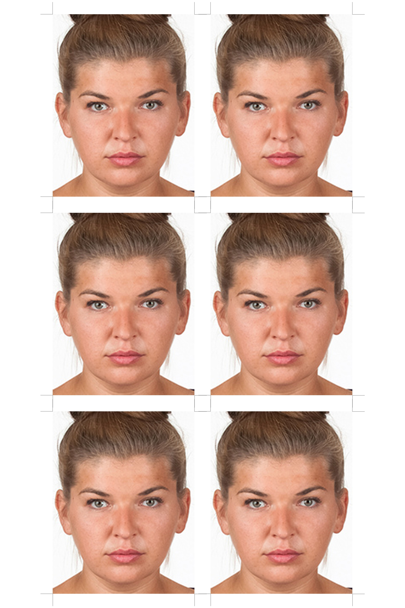
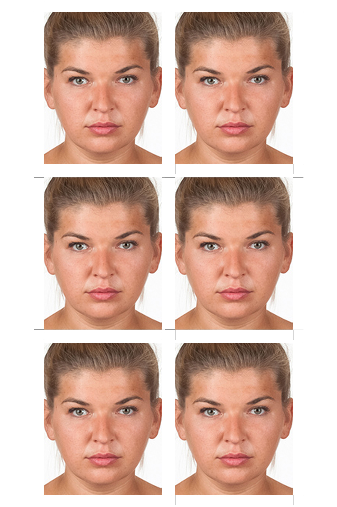

# id-photo-sheet

Turn one or more portrait photos (JPEG/PNG/HEIC/HEIF) into a print-ready
sheet of 35x45mm ID/document photos: 6 copies laid out on one 10x15cm page,
with cut-mark guides, sized for self-service photo kiosks (e.g. Rossmann in
Poland, whose standard print format is 10x15cm / 3:2).

Everything lives in a single script, `id_photo_sheet.py`, no face-detection
dependency.

## Sample

Source photo ([`sample/sample-govpl-image.png`](sample/sample-govpl-image.png),
copied from the official gov.pl example at
[gov.pl/web/gov/zdjecie-do-dowodu-lub-paszportu](https://www.gov.pl/web/gov/zdjecie-do-dowodu-lub-paszportu)):



Generated with:

```bash
python3 id_photo_sheet.py sample-output.jpg sample-govpl-image.png --variants 0.5-1.0,0.65-1.1,0.84-1.2
```

| `bias0p5_zoom1p0` (baseline) | `bias0p65_zoom1p1` | `bias0p84_zoom1p2` |
| --- | --- | --- |
|  |  |  |

All three are full 10x15cm, 6-up sheets -- see [`sample/`](sample/) for the
full-resolution files.

## Requirements

- Python 3.9+
- macOS, Linux, or Windows -- nothing OS-specific, no `sips`/ImageMagick needed

## Setup on a bare machine

```bash
git clone <this-repo-url> id-photo-sheet
cd id-photo-sheet
python3 -m venv .venv
source .venv/bin/activate        # Windows: .venv\Scripts\activate
pip install -r requirements.txt
```

## Usage

### Quick mode (default -- no measuring)

Just pass bare image paths. It assumes each photo is more or less just the
portrait (subject roughly centered, like a typical selfie/headshot) and
crops straight to the 35:45 aspect ratio instead of stretching:

```bash
python3 id_photo_sheet.py sheet.jpg photo.heic
```

Give it more than one photo and the 6 slots split evenly across them,
filled in order (two photos -> 3 copies each, then 3 of the next):

```bash
python3 id_photo_sheet.py sheet.jpg bonnie.heif clyde.heif
```

This is **not** face-aware, so head size/position aren't guaranteed to meet
any document-photo rule -- but you can play with the framing:

- `--zoom` (>= 1.0, default **1.0**): crop in tighter around the center
  instead of using the whole frame. **`1.0` is the baseline/no-op** -- as
  zoomed out as possible while still filling the 35:45 shape, i.e. no extra
  zoom at all. `1.5` crops to 2/3 of the original size and scales it up
  (visibly closer); `2.0` crops to half, etc.
- `--crop-bias` (0.0-1.0, default **0.5**): where that crop sits vertically.
  **`0.5` is the baseline/no-op** (centered, no upward/downward shift) --
  it is *not* `1.0`. `0` keeps the top (crops away the bottom), `1` keeps
  the bottom (crops away the top).

```bash
python3 id_photo_sheet.py sheet.jpg photo.heic --zoom 1.3 --crop-bias 0.2
```

Add `--variants` to generate 3 sheets at once instead of picking one crop
position up front (`_top` / `_center` / `_bottom`, at whatever `--zoom` you
gave, or `1.0` by default):

```bash
python3 id_photo_sheet.py sheet.jpg photo.heic --variants
python3 id_photo_sheet.py sheet.jpg photo.heic --zoom 1.3 --variants
```

Or give `--variants` a comma-separated list of custom values to sweep
instead (any count). Each entry is either a bare zoom level (crop-bias stays
fixed at whatever `--crop-bias` you passed), or `CROP_BIAS-ZOOM` to vary both
together:

```bash
python3 id_photo_sheet.py sheet.jpg photo.heic --variants 1.1,1.2,1.3
# -> sheet_zoom1p1.jpg / sheet_zoom1p2.jpg / sheet_zoom1p3.jpg

# 0.5-1.0 is the baseline/no-op case (centered, no extra zoom), included
# here for comparison against the two zoomed-in, downward-biased variants
python3 id_photo_sheet.py sheet.jpg photo.heic --variants 0.5-1.0,0.65-1.1,0.84-1.2
# -> sheet_bias0p5_zoom1p0.jpg / sheet_bias0p65_zoom1p1.jpg / sheet_bias0p84_zoom1p2.jpg
```

**Every zoom value in a quick-mode `--variants` list must be >= 1.0** -- same
rule as plain `--zoom`: quick mode can only crop tighter than the original
photo, never "zoom out" past it. A value below `1.0` (e.g. `--variants
0.8,1.0,1.2`) will error.

### Precise mode (for a real document photo, exact landmarks)

If quick mode's framing isn't accurate enough (e.g. you're actually
submitting this for an ID/passport application), give it the exact pixel
coordinates of the hairline, chin, and face center instead of letting it
guess. Read these off the photo in any image viewer that shows pixel
position (macOS Preview: hover the cursor, or Tools > Show Inspector; GIMP;
etc.):

```bash
python3 id_photo_sheet.py sheet.jpg --photo me.heic 83 1858 1134
```

(`--photo PATH HAIR_TOP CHIN FACE_CENTER_X`, repeatable for more than one
person.) The crop is framed so the head fills `--zoom` of the 45mm frame
height here too, but with a different meaning: it's a fraction (default
`0.68`), where higher = zoomed in/tighter, lower = zoomed out -- most
official rules want roughly 70-80%:

```bash
python3 id_photo_sheet.py sheet.jpg --photo me.heic 83 1858 1134 --zoom 0.75
python3 id_photo_sheet.py sheet.jpg --photo me.heic 83 1858 1134 --variants
# -> sheet_tight.jpg / sheet_medium.jpg / sheet_zoomedout.jpg (zoom 0.75/0.68/0.63)
```

### Cut-mark guides

Every sheet gets small gray corner tick marks by default, showing exactly
where to cut each 35x45mm photo apart. Turn them off with `--no-cut-marks`
(e.g. if your printer already adds its own guides, or you just want a clean
image):

```bash
python3 id_photo_sheet.py sheet.jpg photo.heic --no-cut-marks
```

### Print

Take the resulting sheet (10x15cm, 600 DPI) to a Rossmann photo kiosk (or
any photo printer) and print it at the standard **10x15cm** size. Cut along
the corner guide marks (unless disabled) to separate the 6 individual
35x45mm photos.

## Notes / limitations

- Quick mode has no face-detection -- it assumes the subject is roughly
  centered, which holds for a typical selfie/portrait but isn't guaranteed.
  Use `--zoom`/`--crop-bias`/`--variants` to dial in the framing by eye.
- Precise mode's landmarks are measured by eye too, just against exact pixel
  coordinates instead of guessed proportions. For a real submitted document
  photo (dowod osobisty, wniosek, etc.), double-check the result against the
  current official requirements (neutral expression, mouth closed, eyes
  open, plain light background, correct head-height proportion) either way.
